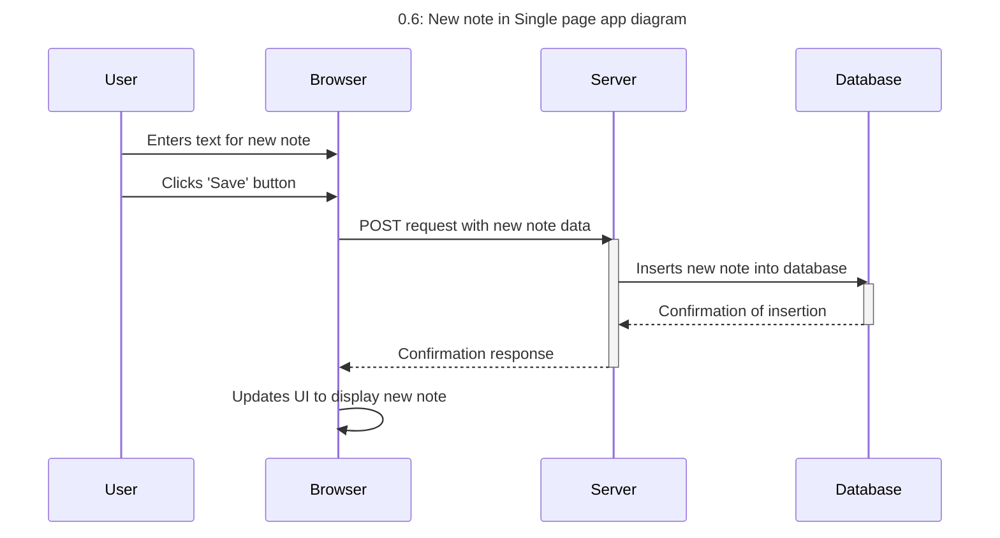

```mermaid
sequenceDiagram
    title 0.6: New note in Single page app diagram
    participant User
    participant Browser
    participant Server
    participant Database

    User->>Browser: Enters text for new note
    User->>Browser: Clicks 'Save' button
    Browser->>Server: POST request with new note data
    activate Server
    Server->>Database: Inserts new note into database
    activate Database
    Database-->>Server: Confirmation of insertion
    deactivate Database
    Server-->>Browser: Confirmation response
    deactivate Server
    Browser->>Browser: Updates UI to display new note


```
